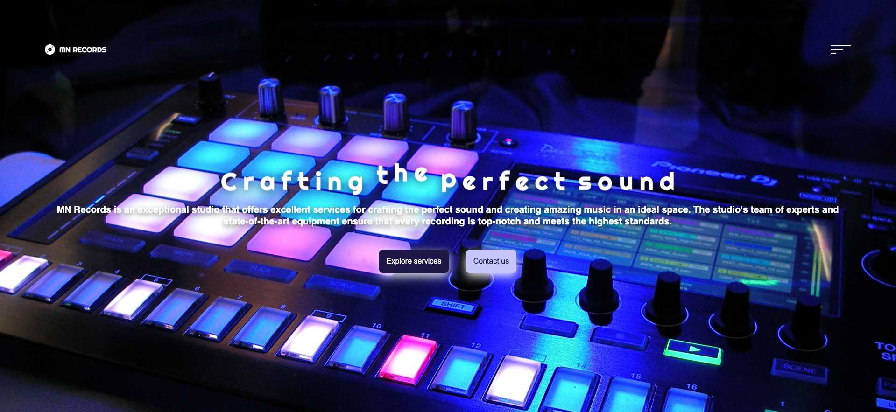

# MN Records 💿

## Table of Contents
  * [Description](#description)
  * [Tools](#tools)
  * [Usage](#usage)
  * [Contributing](#contributing)
  * [Demo](#demo)
  * [Contact](#contact)
  * [License](#license)
  * [Credits](#credits)

## Description
This project is a simple business webpage, ideal for new and small businesses which care about details, and well sold services they provide in aestetic and classy way. In this case, MN Records may introcude their business and services they provide throught the webpage to new clients and let them contact directly to get more details.

[Webpage](https://mrsannanoga.github.io/mn-records/) is live and enable to view online.

## Tools
 

## Usage
Presented webpage includes a navigation section enable to be seen via burger icon on the top right corner of webpage. Clicking on the burger let you get access into navigation. After clicking on one component of your choice, the UI scrolls down to the chosen section. Sections available are: about us, services and contact. Webpage is also available to view on any devices like smartphones or tablets.

## Contributing
This project was inspired by one of the DevelopedByEd tutorials.       
## Demo

## Contact
You can reach me on:  
[Email](mailto:mrs.anna.noga@gmail.com)  
[GitHub](https://github.com/mrsannanoga) 

## License
N/A 

## Author
Anna Noga
  